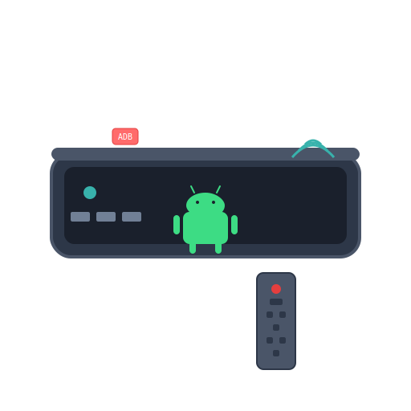

# Android TV Box Integration for Home Assistant

<div align="center">



[![GitHub Release][releases-shield]][releases]
[![GitHub Activity][commits-shield]][commits]
[![License][license-shield]][license]
[![hacs][hacsbadge]][hacs]

![Project Maintenance][maintenance-shield]

**A comprehensive Home Assistant integration for controlling Android TV Box devices via ADB (Android Debug Bridge)**

</div>

## Features

- **ADB Connection Management**: Monitor and control ADB connection status
- **Power Control**: Turn your Android TV Box on/off remotely  
- **WiFi Management**: Enable/disable WiFi on supported devices
- **Device Information**: Automatic detection of device model, Android version, and brand
- **Real-time Monitoring**: Live status updates with configurable intervals
- **Dynamic Icons**: Smart icons that change based on device state
- **Multi-language Support**: English and Chinese localization
- **HACS Compatible**: Easy installation through Home Assistant Community Store

### Dynamic Icons

| Entity | State | Icon | Description |
|--------|-------|------|-------------|
| Power Switch | On | `🟢 mdi:television-box` | Device is powered on |
| Power Switch | Standby | `🟡 mdi:television-ambient-light` | Device in standby mode |
| Power Switch | Off | `⚫ mdi:television-off` | Device is powered off |
| WiFi Switch | Connected | `🟢 mdi:wifi` | WiFi enabled and connected |
| WiFi Switch | Enabled | `🟡 mdi:wifi-strength-1` | WiFi enabled but not connected |
| WiFi Switch | Disabled | `🔴 mdi:wifi-off` | WiFi disabled |
| ADB Connection | Connected | `🟢 mdi:usb-port` | ADB connection active |

## Quick Start

### Prerequisites

1. **Android TV Box** with ADB debugging enabled
2. **Network access** between Home Assistant and your Android device
3. **ADB port** accessible (typically port 5555)

### Enable ADB on Your Android TV Box

1. **Enable Developer Options**:
   - Go to Settings → About → Build number
   - Tap "Build number" 7 times
   - Developer options will appear in Settings

2. **Enable ADB Debugging**:
   - Go to Settings → Developer Options
   - Enable "ADB debugging" or "USB debugging"
   - Enable "ADB debugging (Wireless)" if available

3. **Note Your Device IP**:
   - Go to Settings → Network → Check your IP address
   - Default ADB port is usually 5555

### Installation

#### Option 1: HACS (Recommended)

1. Open HACS in Home Assistant
2. Go to "Integrations"
3. Click the three dots in the top right corner
4. Select "Custom repositories"
5. Add this repository URL: `https://github.com/bo/isg-android-service`
6. Select category: "Integration"
7. Click "Add"
8. Find "Android TV Box Integration" in HACS
9. Click "Install"
10. Restart Home Assistant

#### Option 2: Manual Installation

1. Download the latest release from [releases page][releases]
2. Extract the `custom_components/android_tv_box` folder
3. Copy it to your Home Assistant `custom_components` directory
4. Restart Home Assistant

### Configuration

1. Go to **Settings** → **Devices & Services** → **Add Integration**
2. Search for "Android TV Box" and select it
3. Enter your device information:
   - **IP Address**: Your Android TV Box IP address
   - **ADB Port**: Usually 5555 (default)
   - **Device Name**: A friendly name for your device
4. Click "Submit"

### Entities Created

After successful configuration, the following entities will be available:

| Entity | Type | Description |
|--------|------|-------------|
| `switch.{device_name}_adb_connection` | Switch | Monitor and control ADB connection |
| `switch.{device_name}_power` | Switch | Control device power state |
| `switch.{device_name}_wifi` | Switch | Enable/disable WiFi |

Each entity provides additional attributes with detailed status information.

## Usage Examples

### Automation Examples

```yaml
# Turn on TV Box when arriving home
automation:
  - alias: "Turn on TV Box when home"
    trigger:
      - platform: zone
        entity_id: person.you
        zone: zone.home
        event: enter
    action:
      - service: switch.turn_on
        target:
          entity_id: switch.living_room_tv_box_power

# Monitor ADB connection and notify if disconnected
automation:
  - alias: "TV Box Connection Alert"
    trigger:
      - platform: state
        entity_id: switch.living_room_tv_box_adb_connection
        to: "off"
        for:
          minutes: 5
    action:
      - service: notify.mobile_app_your_phone
        data:
          title: "TV Box Disconnected"
          message: "ADB connection to TV Box has been lost"
```

### Manual Control

Use the entities in your dashboards or call services:

```yaml
# In your dashboard
type: entities
entities:
  - switch.living_room_tv_box_power
  - switch.living_room_tv_box_wifi
  - switch.living_room_tv_box_adb_connection
```

## Troubleshooting

### Common Issues

1. **"Cannot connect to device"**
   - Verify ADB debugging is enabled
   - Check IP address and port
   - Ensure network connectivity
   - Test manually: `adb connect <ip>:5555`

2. **"Permission denied" errors**
   - Some features may require root access
   - WiFi control might not work on all devices
   - Check device security settings

3. **Connection timeouts**
   - Verify network stability
   - Check if device IP has changed
   - Restart ADB service on device

### Enable Debug Logging

Add this to your `configuration.yaml`:

```yaml
logger:
  logs:
    custom_components.android_tv_box: debug
```

### Manual ADB Testing

Test ADB connection manually:

```bash
# Connect to device
adb connect 192.168.1.100:5555

# Test basic commands
adb shell echo "test"
adb shell dumpsys power | grep mWakefulness
adb shell settings get global wifi_on
```

## Development

### Project Structure

```
custom_components/android_tv_box/
├── __init__.py              # Integration setup
├── manifest.json            # Integration metadata
├── config_flow.py           # Configuration UI
├── const.py                 # Constants and commands
├── coordinator.py           # Data update coordinator
├── adb_manager.py           # ADB connection handler
├── switch.py                # Switch entities
├── strings.json             # UI strings
└── translations/            # Localization
    ├── en.json              # English
    └── zh.json              # Chinese
```

### Contributing

1. Fork the repository
2. Create a feature branch
3. Make your changes
4. Add tests if applicable
5. Submit a pull request

## Roadmap

- [ ] Media player entity for playback control
- [ ] Camera entity for screenshots
- [ ] Sensor entities for system monitoring
- [ ] Button entities for navigation
- [ ] ISG application monitoring
- [ ] Number entity for brightness control
- [ ] Select entity for app switching

## Support

- [GitHub Issues][issues] - Bug reports and feature requests
- [Home Assistant Community][ha-community] - General discussion
- [Documentation][docs] - Detailed documentation

## License

This project is licensed under the MIT License - see the [LICENSE](LICENSE) file for details.

## Credits

- Inspired by the comprehensive Android TV Box integration design
- Built following Home Assistant development best practices
- Uses [adb-shell](https://github.com/JeffLIrion/adb_shell) library for ADB communication

---

[commits-shield]: https://img.shields.io/github/commit-activity/y/bo/isg-android-service.svg?style=for-the-badge
[commits]: https://github.com/bo/isg-android-service/commits/main
[hacs]: https://hacs.xyz
[hacsbadge]: https://img.shields.io/badge/HACS-Custom-orange.svg?style=for-the-badge
[license-shield]: https://img.shields.io/github/license/bo/isg-android-service.svg?style=for-the-badge
[license]: https://github.com/bo/isg-android-service/blob/main/LICENSE
[maintenance-shield]: https://img.shields.io/badge/maintainer-%40bo-blue.svg?style=for-the-badge
[releases-shield]: https://img.shields.io/github/release/bo/isg-android-service.svg?style=for-the-badge
[releases]: https://github.com/bo/isg-android-service/releases
[issues]: https://github.com/bo/isg-android-service/issues
[ha-community]: https://community.home-assistant.io
[docs]: https://github.com/bo/isg-android-service/wiki